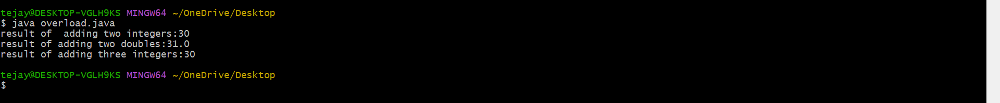
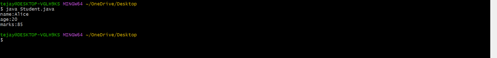

# experiment-2a
## Topic :-implementation of myclass
## source code
```java
class Myclass{
void displayMessage(){
System.out.println("welcome to java program!");
}
int add(int a,int b)
{
 return a + b;
}
}
public  class ClassDemo{
public static void main(String[] args){
Myclass obj = new Myclass();
obj.displayMessage();
System.out.println("Addition result:"+obj.add(10,20));
}
}
```
## output:


## experiment 2b
## toipc :- overloding
## souce code
```java
class Overloding{
int add(int a,int b){
return a+b;
}
double add(double a, double b){
return a+b;
}
int add(int a,int b, int c){
return a+b+c;
}
public static void main(String[] args){
Overloding obj =new Overloding();
int result1=obj.add(10,20);
double result2=obj.add(10.5,20.5);
int result3=obj.add(5,20,10);
System.out.println("int result:"+result1);
System.out.println("double result:"+result2);
System.out.println("int three result:"+result3);
}
}
```
## output


## experiment 2c
## topic :- Student
## source code
```java
public class Student{
String name;
int age;
int marks;
Student(String n,int a,int m){
name = n;
age = a;
marks = m;
}
void display(){
System.out.println("name:"+name);
System.out.println("age:"+age);
System.out.println("marks:"+marks);
}
public static void main(String[] args){
Student s1=new Student("Alice",20,85);
s1.display();
}
}
```
# output

